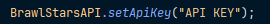
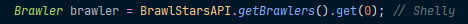
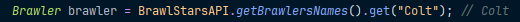
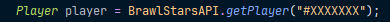

## 1. Setup
### To get started, you need to get an [API KEY](https://developer.brawlstars.com/#/account)
After that, you need to copy the secret token, __DO NOT SHOW IT TO ANYONE!__
In order for the library to work, you need to set the API KEY value

The library is now ready for use.

## 2. Objects
### Brawlers
Brawler - Object of the brawler

Gadget - Object of the brawler`s gadget

StarPower - Object of the brawler`s star power

PlayerBrawler - Object of the player`s brawler

### Players
Player - Object of the player

Club - Object of the club

ClubMember - Object of the player, who is a member of the club

Battle - Object of the player`s battle

## 3. Examples
### Brawlers
Object of the brawler can be obtained in two ways: get it by ID or name

Getting by ID:

Getting by name:

### Players
A player can be obtained by a tag that starts with '#'

